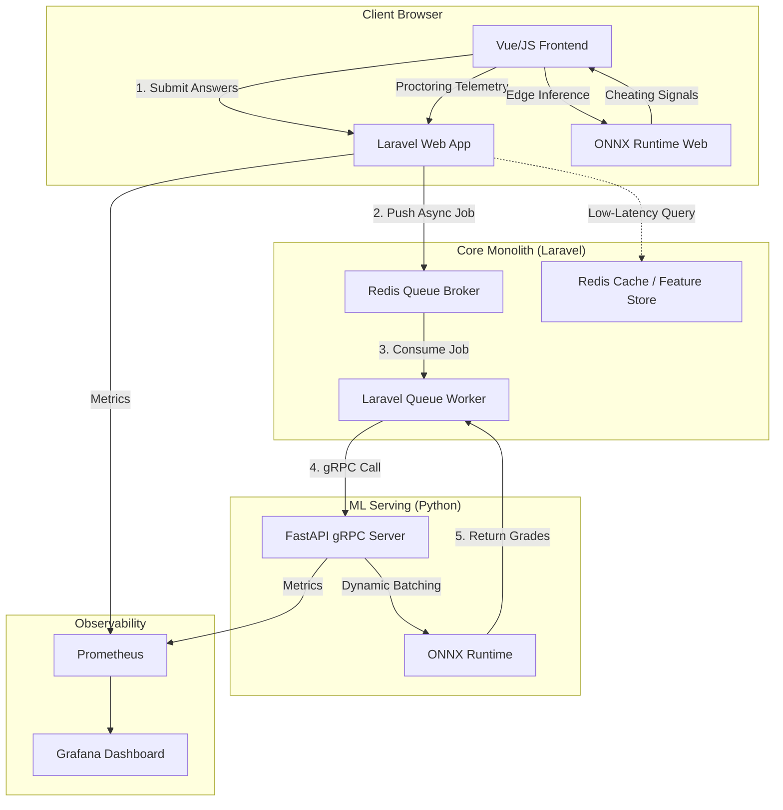

# Edu Hab: ML & Backend Systems Engineering Learning Roadmap

This document outlines a structured, **1-month intensive roadmap** designed to build production-grade **Backend Engineering** and **ML Systems (MLOps)** skills. 

Rather than writing toy Python scripts, you will transform **Edu Hab** from a standard monolith into a **polyglot, event-driven, microservice-based ML system** using real-world engineering paradigms.

---

## 🗺️ System Architecture (Target State)

You will evolve Edu Hab from a single Laravel monolith into a distributed system:

---

## 🚀 Module 1: Polyglot Microservice Architecture (gRPC & Protobuf)
* **Goal**: Separate your core web logic (PHP/Laravel) from heavy machine learning compute (Python) using high-performance IPC.
* **Why it has Engineering Significance**: 
  In industry, ML models are rarely hosted directly inside web application runtimes. Doing so slows down request processing and creates library dependency conflicts. Engineers write lightweight ML microservices and connect them via **gRPC**, which uses binary serialization (Protocol Buffers) for extreme speed and low network bandwidth compared to REST/JSON.

### 1. Build a Python ML Microservice (FastAPI + gRPC)
* **Task**:
  * Set up a Python service using **FastAPI** or a pure Python **gRPC** framework.
  * Load a lightweight NLP model (e.g., a **SentenceTransformer** model like `all-MiniLM-L6-v2` or a Hugging Face model for text summarization/extraction).
  * Implement two endpoints:
    1. `GradeAnswer`: Computes the cosine similarity between a student's answer and a teacher's model answer (semantic grading).
    2. `GenerateQuestions`: Accepts a block of text and extracts 5 multiple-choice questions (using an LLM/TFLite/ONNX API).

### 2. Implement the gRPC Contract
* **Task**:
  * Write a `.proto` file defining the request and response structures for the endpoints.
  * Compile the Protobuf files into Python helper classes and PHP classes (using `grpc/grpc` Composer package).
  * Connect Laravel to the Python service using a gRPC client channel instead of an HTTP REST call.
  * Measure and compare: Serialization/Deserialization latency of gRPC vs. JSON over REST.

---

## 🔄 Module 2: Asynchronous Event-Driven Workflows (Redis + Laravel Queues)
* **Goal**: Offload slow, blocking ML generation tasks from the HTTP request-response cycle and stream updates in real-time.
* **Why it has Engineering Significance**:
  Running an LLM or an embedding model takes from 200ms to 5 seconds. If a teacher requests question generation for a 20-page document, the web server thread will block, leading to timeouts and a degraded user experience. Async workers process these requests in the background.

### 1. Queue-Backed ML Ingest
* **Task**:
  * Configure Laravel to use **Redis** as its queue broker (see `config/queue.php`).
  * Create a Laravel Job `GenerateQuizFromText` that accepts the source document.
  * When a teacher clicks "Generate Quiz", dispatch the job to the queue immediately and return a `202 Accepted` response.
  * The queue worker picks up the job, communicates with the Python ML microservice via gRPC, stores the generated questions in MySQL, and updates the database state.

### 2. Real-Time Push notifications (Laravel Reverb)
* **Task**:
  * Use **Laravel Reverb** (WebSockets) to broadcast a `QuizGenerationCompleted` event.
  * Bind the client-side JavaScript to listen to this channel and update the UI instantly when the questions are generated, showing a beautiful transition from "Generating..." to the list of generated questions.

---

## 🧠 Module 3: ML Inference Optimizations & Dynamic Batching
* **Goal**: Maximize throughput and minimize hardware costs when multiple students submit quizzes concurrently.
* **Why it has Engineering Significance**:
  Deep learning models perform math matrix operations. Running inference on 10 individual requests one-by-one is highly inefficient. Dynamic batching groups incoming requests over a tiny window (e.g., 10 milliseconds) and runs them as a single batch through the neural network, drastically increasing throughput.

### 1. Implement Dynamic Batching
* **Task**:
  * In your Python microservice, write a custom queue loop or use a framework (like Triton Inference Server, or custom asyncio queue matching) that aggregates incoming `GradeAnswer` requests.
  * If 8 students submit their answers within 15ms, the Python service should queue them, merge their text into a single batch of size 8, run the SentenceTransformer forward pass once, and distribute the results back to the individual gRPC responses.
  * Profile the latency and throughput (requests per second) under load testing.

### 2. Caching & Feature Store (Redis)
* **Task**:
  * Because student answers might repeat, or teachers might reuse questions, compute model answer embeddings once and cache them in **Redis**.
  * When comparing a student's answer, fetch the pre-computed teacher-answer embedding from Redis rather than calculating it on every single request.

---

## 🌐 Module 4: Client-Side Edge Inference & Telemetry Rate Limiting
* **Goal**: Offload proctoring detection to the client browser and implement resilient backend telemetry ingestion.
* **Why it has Engineering Significance**:
  Streaming continuous webcam video or massive keylogger event streams to a central server to detect cheating crashes server bandwidth. Modern ML systems run light classification on the edge (the client's device) and only stream high-level classification telemetry back to the backend.

### 1. Browser-based ML (ONNX Runtime Web)
* **Task**:
  * Export a light face-mesh or object detection model (e.g., MobileNet/YOLO) to ONNX format.
  * Integrate **ONNX Runtime Web** (Wasm-powered) in the Edu Hab quiz page.
  * Run local face-detection on the webcam feed in the browser: detect if the student looks away from the screen, if their face disappears, or if a phone is in the frame.

### 2. Scoped Telemetry Ingest & Redis Rate Limiting
* **Task**:
  * When an anomaly is detected, the browser sends a proctoring alert telemetry payload to Laravel.
  * Implement **Redis rate limiting** on the telemetry endpoint. If a compromised or malicious client floods the endpoint with telemetry requests, return a `429 Too Many Requests` instantly.
  * Implement token-based authorization scoped only to that specific active quiz attempt.

---

## 🔒 Module 5: Observability & Production Monitoring
* **Goal**: Gain complete visibility into your system's performance, health, and model behavior.
* **Why it has Engineering Significance**:
  "You cannot manage what you cannot measure." In ML systems, you must monitor not only system resources (RAM, CPU) but also ML metrics like latency percentiles (P95, P99), model confidence scores, and input/output distribution shift to catch model failures early.

### 1. Instrument Prometheus Metrics
* **Task**:
  * Instrument the Laravel backend and Python microservice to expose metrics endpoints.
  * Track metrics:
    * `ml_inference_latency_seconds_bucket`: Distribution of model execution times.
    * `grpc_requests_total`: Count of inter-service calls.
    * `active_quiz_sessions`: Active socket connections.
    * `model_similarity_score_average`: Monitor if grades are drifting over time.

### 2. Grafana Dashboards
* **Task**:
  * Write a `docker-compose.yml` to spin up **Prometheus** and **Grafana**.
  * Build a Grafana dashboard visualizing:
    * Request throughput and error rates.
    * P95/P99 gRPC request latency.
    * Active queue size and worker processing lag.
    * A summary of proctoring anomalies detected across rooms.

---

## 📆 Recommended 4-Week Execution Plan

| Week | Focus Area | Core Technologies | Target Outcome |
| :--- | :--- | :--- | :--- |
| **Week 1** | **Polyglot Communication** | FastAPI, gRPC, Protobuf, PHP Client | Laravel communicates with Python via high-speed gRPC binary protocols. |
| **Week 2** | **Background Queues & WebSockets** | Laravel Queues, Redis, Reverb | AI-assisted quiz generation runs in background; UI updates in real-time. |
| **Week 3** | **Model Serving Optimization** | ONNX, SentenceTransformers, Redis | Dynamic batching and Redis caching increase backend throughput by 4-5x. |
| **Week 4** | **Observability & Edge Proctoring** | Prometheus, Grafana, ONNX Runtime Web | The app is fully monitored with Grafana dashboards and local browser proctoring. |

---

> [!TIP]
> **Suggested First Step**: Start with **Week 1**. Create a subdirectory `ml_service/` inside your project root, set up a virtual Python environment, write your first `.proto` schema, and establish a gRPC link between Laravel and Python. This lays the architectural foundation for all subsequent steps.
